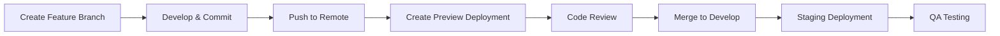
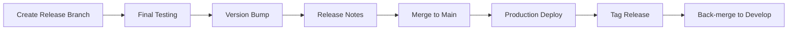
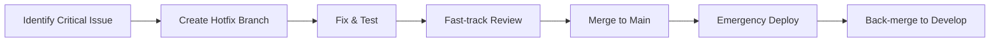

# Git Branching Strategy for Antsss Platform

## Overview
This document outlines the comprehensive Git branching strategy designed to support rapid development cycles while maintaining code quality and production stability. Our strategy is optimized for the 6-week sprint cycles and enables seamless collaboration across teams.

## Branch Types and Purposes

### Main Branches

#### `main` (Production)
- **Purpose**: Production-ready code
- **Deployments**: Automatic deployment to production
- **Protection**: Highest level of protection
- **Merge Requirements**: 
  - 2 required approvals from code owners
  - All CI checks must pass
  - Linear history required
  - Conversations must be resolved
- **Merge Sources**: Only from `release/*` or critical `hotfix/*` branches

#### `develop` (Integration)
- **Purpose**: Integration branch for ongoing development
- **Deployments**: Automatic deployment to staging environment
- **Protection**: Standard protection with quality gates
- **Merge Requirements**:
  - 1 required approval
  - All CI checks must pass
  - Conversations must be resolved
- **Merge Sources**: `feature/*`, `bugfix/*`, and `improvement/*` branches

#### `staging` (Pre-production)
- **Purpose**: Final testing before production release
- **Deployments**: Manual deployment trigger to staging environment
- **Protection**: High protection level
- **Merge Requirements**:
  - 1 required approval from maintainers
  - All CI checks must pass
  - Staging health checks must pass
- **Merge Sources**: Only from `develop` or `release/*` branches

### Development Branches

#### `feature/[ticket-id]-[short-description]`
**Examples**: `feature/ANT-123-user-authentication`, `feature/ANT-456-booking-system`

- **Purpose**: New feature development
- **Lifetime**: Duration of feature development (typically 1-3 sprints)
- **Base Branch**: `develop`
- **Merge Target**: `develop`
- **Protection**: Minimal (allows force pushes during development)
- **Naming Convention**: `feature/[JIRA-ID]-[kebab-case-description]`
- **Auto-deletion**: After successful merge

#### `bugfix/[ticket-id]-[short-description]`
**Examples**: `bugfix/ANT-789-login-error`, `bugfix/ANT-012-image-upload-fail`

- **Purpose**: Bug fixes for non-critical issues
- **Lifetime**: Short (typically 1-5 days)
- **Base Branch**: `develop`
- **Merge Target**: `develop`
- **Protection**: Standard CI checks
- **Auto-deletion**: After successful merge

#### `improvement/[ticket-id]-[short-description]`
**Examples**: `improvement/ANT-345-performance-optimization`, `improvement/ANT-678-ui-enhancement`

- **Purpose**: Code improvements, refactoring, performance optimizations
- **Lifetime**: Medium (typically 1-2 weeks)
- **Base Branch**: `develop`
- **Merge Target**: `develop`
- **Protection**: Standard CI checks
- **Auto-deletion**: After successful merge

### Release Branches

#### `release/v[major].[minor].[patch]`
**Examples**: `release/v1.2.0`, `release/v2.0.0`

- **Purpose**: Prepare releases, final bug fixes, version bumping
- **Lifetime**: Short (1-3 days for final preparations)
- **Base Branch**: `develop`
- **Merge Targets**: `main` and back-merge to `develop`
- **Protection**: High protection level
- **Version Management**: Semantic versioning
- **Release Notes**: Auto-generated from commits

### Emergency Branches

#### `hotfix/[ticket-id]-[critical-description]`
**Examples**: `hotfix/ANT-999-security-vulnerability`, `hotfix/ANT-888-payment-failure`

- **Purpose**: Critical fixes that need immediate production deployment
- **Lifetime**: Very short (hours to 1 day)
- **Base Branch**: `main`
- **Merge Targets**: `main` and `develop`
- **Protection**: Streamlined but secure
- **Requirements**: 1 approval (expedited process)
- **Notification**: Alerts sent to all team members

## Workflow Processes

### Feature Development Workflow


1. **Branch Creation**:
   ```bash
   git checkout develop
   git pull origin develop
   git checkout -b feature/ANT-123-user-authentication
   ```

2. **Development**:
   - Make commits following conventional commit format
   - Push regularly to enable preview deployments
   - Write tests for new functionality

3. **Pre-merge Checklist**:
   - [ ] Code follows style guidelines
   - [ ] Tests written and passing
   - [ ] Documentation updated
   - [ ] No merge conflicts with develop
   - [ ] Feature tested in preview environment

4. **Pull Request Process**:
   - Use PR template (auto-populated)
   - Link to relevant tickets
   - Include screenshots/demos for UI changes
   - Request review from appropriate code owners

### Release Workflow


1. **Release Preparation** (Week 5 of sprint):
   ```bash
   git checkout develop
   git pull origin develop
   git checkout -b release/v1.2.0
   ```

2. **Release Finalization**:
   - Update version numbers
   - Generate/update CHANGELOG.md
   - Final QA testing on staging
   - Security scan and audit

3. **Production Release**:
   - Merge to main via PR
   - Automatic production deployment
   - Monitor deployment health
   - Create GitHub release with notes

### Hotfix Workflow


1. **Emergency Response**:
   ```bash
   git checkout main
   git pull origin main
   git checkout -b hotfix/ANT-999-critical-security-fix
   ```

2. **Quick Fix Process**:
   - Minimal but focused changes
   - Emergency testing protocol
   - Single reviewer approval
   - Immediate deployment

## Branch Protection Rules

### Main Branch Protection
- **Required Status Checks**: All CI/CD pipelines must pass
- **Required Reviews**: 2 approvals from code owners
- **Dismiss Stale Reviews**: Enabled
- **Require Branches Up-to-date**: Enabled
- **Restrict Pushes**: Only release and hotfix branches
- **Force Push**: Disabled
- **Branch Deletion**: Disabled

### Develop Branch Protection
- **Required Status Checks**: Core CI checks (lint, test, build)
- **Required Reviews**: 1 approval
- **Auto-merge**: Enabled for approved PRs
- **Dismiss Stale Reviews**: Enabled
- **Force Push**: Disabled

### Feature Branch Guidelines
- **Naming**: Must follow convention
- **Force Push**: Allowed during development
- **Auto-deletion**: After merge
- **CI Checks**: Basic checks required

## Environment Mapping

| Branch Pattern | Environment | Deployment | URL Pattern |
|----------------|-------------|------------|-------------|
| `main` | Production | Auto | `https://antsss.com` |
| `develop` | Staging | Auto | `https://staging.antsss.com` |
| `staging` | Pre-prod | Manual | `https://preprod.antsss.com` |
| `feature/*` | Preview | Auto | `https://feature-[name].antsss.com` |
| `release/*` | Release Staging | Auto | `https://release-[version].antsss.com` |

## Commit Message Convention

We use [Conventional Commits](https://www.conventionalcommits.org/) format:

```
<type>[optional scope]: <description>

[optional body]

[optional footer(s)]
```

### Commit Types:
- `feat`: New feature
- `fix`: Bug fix
- `docs`: Documentation only changes
- `style`: Changes that don't affect code meaning (white-space, formatting, etc.)
- `refactor`: Code change that neither fixes a bug nor adds a feature
- `perf`: Code change that improves performance
- `test`: Adding missing tests or correcting existing tests
- `chore`: Changes to the build process or auxiliary tools

### Examples:
```
feat(auth): add OAuth2 integration for Google login

fix(booking): resolve duplicate booking creation issue

docs(api): update authentication endpoint documentation

refactor(components): extract common form validation logic
```

## Automation and Tooling

### Automated Branch Management
- **Branch Creation**: Jira integration creates branches from tickets
- **Naming Validation**: GitHub Actions validate branch naming
- **Stale Branch Cleanup**: Weekly cleanup of merged branches
- **Conflict Detection**: Early warning system for merge conflicts

### Quality Gates
1. **Pre-commit Hooks** (Husky + lint-staged):
   - ESLint with auto-fix
   - Prettier formatting
   - TypeScript type checking
   - Security scanning (basic)

2. **CI Pipeline Checks**:
   - Comprehensive linting
   - Unit test coverage (>80%)
   - Integration tests
   - E2E test suite
   - Security vulnerability scan
   - Bundle size analysis
   - Performance regression tests

3. **Deployment Checks**:
   - Health check endpoints
   - Database migration validation
   - Feature flag verification
   - Rollback readiness

### Preview Deployments
- **Automatic**: Every feature branch gets a preview URL
- **Environment**: Isolated with test data
- **Lifecycle**: Created on push, updated on subsequent pushes
- **Cleanup**: Removed after branch deletion
- **Access**: Authenticated access for team members

## Sprint Integration (6-Week Cycles)

### Week 1-2: Planning & Setup
- Feature branches created from tickets
- Initial development and prototyping
- Preview deployments for early feedback

### Week 3-4: Core Development
- Feature completion and testing
- Code reviews and iterations
- Integration with develop branch

### Week 5: Integration & Testing
- Release branch creation
- Comprehensive testing on staging
- Bug fixes and final adjustments

### Week 6: Release & Retrospective
- Production deployment
- Post-release monitoring
- Sprint retrospective and planning

## Troubleshooting Common Issues

### Merge Conflicts
```bash
# Update your branch with latest develop
git checkout develop
git pull origin develop
git checkout your-feature-branch
git rebase develop

# Resolve conflicts and continue
git add .
git rebase --continue
```

### Hotfix Process
```bash
# For critical production issues
git checkout main
git pull origin main
git checkout -b hotfix/ANT-999-critical-issue

# After fix
git push origin hotfix/ANT-999-critical-issue
# Create PR with "hotfix" label for expedited review
```

### Branch Cleanup
```bash
# List merged branches
git branch --merged develop

# Delete local merged branches (excluding main/develop)
git branch --merged develop | grep -v "develop\|main" | xargs -n 1 git branch -d

# Delete remote tracking branches
git remote prune origin
```

## Best Practices

### Branch Management
1. **Keep branches focused**: One feature/fix per branch
2. **Regular updates**: Rebase frequently to avoid conflicts
3. **Clean commits**: Squash related commits before merging
4. **Descriptive names**: Use ticket IDs and clear descriptions

### Code Quality
1. **Test coverage**: Maintain >80% code coverage
2. **Documentation**: Update docs with code changes
3. **Performance**: Monitor bundle size and performance metrics
4. **Security**: Regular dependency updates and security scans

### Collaboration
1. **Code reviews**: Thorough but timely reviews
2. **Communication**: Use PR descriptions and comments effectively
3. **Knowledge sharing**: Document decisions and architectural changes
4. **Mentoring**: Junior developers pair with seniors on complex features

## Security Considerations

### Branch Security
- **Sensitive data**: Never commit secrets or API keys
- **Access control**: Branch protection rules enforce proper access
- **Audit trail**: All changes tracked and attributable

### Deployment Security
- **Environment separation**: Strict separation between environments
- **Secret management**: Use environment variables and secret stores
- **Access logs**: Monitor and log all deployment activities

This branching strategy is designed to scale with team growth while maintaining the rapid development pace essential for the Antsss platform's success.